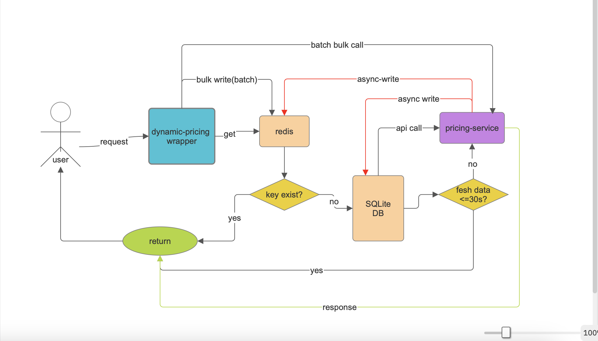

# Dynamic Pricing Wrapper API

## Features 
    - Docker compose for /pricing service and redis and redis-ui
    - Batch for the background bulk fetch from the /pricing service to minimize the api calls
    - Caching with Redis
        - bulk push to redis from batch
        - If redis miss, call upstream service and write to Redis
    - Coalescing for multi-same request to api to avoid calls multiple time at a instance of time (if redis-miss and db-miss)
    - Circuit breaker for protecting upstream service with overflooded request.
    - Retry mechanism for Upstream service if the service goes down, our app try to connect with a certain interval
    - Built-in health monitoring and fallback for the upstream service (pricing)
        - if service recovers after the trouble the app detects itself and make bulk fetch to protect api quota
    - SQLite for historical data (to failover the redis failure) (configurable fresh period )
    - All configurable values in env specific
    - Test cases

## Request Flow Design
flow diagram


## Start the application (by using docker-compose)(*recomended)
```bash
# it uses production by default
# I have disabled the SSL to test with http
$ docker compose up -d --build #mandatory to run redis, pricing-service and the dynamic-pricing-wrapper
```

## Start the application (by using rail native command)
```bash
$ docker compose up -d --build #mandatory to run redis and pricing-service
$ bundel install
# to run development mode
$ bin/rails db:create db:migrate db:seed
$ bin/rails server -b 0.0.0.0 -p 3000
# to run production mode (I have turned off forced_SSL)
$ RAILS_ENV=production bin/rails db:create db:migrate db:seed
$ RAILS_ENV=production bin/rails server -b 0.0.0.0 -p 3000
```

## API

### Endpoint: /pricing
### Method: GET

## Usage
### Single Rate fetch

#### Request

```bash
http://localhost:3000/pricing?period=Winter&hotel=FloatingPointResort&room=SingletonRoom
```

#### Expected Response
```json
{
  "period": "Winter",
  "hotel": "FloatingPointResort",
  "room": "SingletonRoom",
  "rate": "73200",
  "timestamp": "2026-01-07T05:55:46Z"
}
```
### Multi-rate fetch
#### Request
```bash
http://localhost:3000/pricing
```
#### Request body (json):
```json
{
  "rates": [
    {
      "period": "Summer",
      "hotel": "FloatingPointResort",
      "room": "SingletonRoom"
    },
    {
      "period": "Autumn",
      "hotel": "FloatingPointResort",
      "room": "SingletonRoom"
    },
    {
      "period": "Winter",
      "hotel": "FloatingPointResort",
      "room": "SingletonRoom"
    },
    {
      "period": "Spring",
      "hotel": "FloatingPointResort",
      "room": "SingletonRoom"
    }
  ]
}
```
#### Expected Response:
```bash
{
    "rates": [
        {
            "period": "Summer",
            "hotel": "FloatingPointResort",
            "room": "SingletonRoom",
            "rate": "56100"
        },
        {
            "period": "Autumn",
            "hotel": "FloatingPointResort",
            "room": "SingletonRoom",
            "rate": "76600"
        },
        {
            "period": "Winter",
            "hotel": "FloatingPointResort",
            "room": "SingletonRoom",
            "rate": "43400"
        },
        {
            "period": "Spring",
            "hotel": "FloatingPointResort",
            "room": "SingletonRoom",
            "rate": "71800"
        }
    ]
}
```


## Test
```bash
# full test suite
$ bin/rails test 

# run a specific directory
$ bin/rails test test/controllers
$ bin/rails test test/services
$ bin/rails test test/services/helpers

# run a specific file
$ bin/rails test test/controllers/pricing_controller_test.rb

# runa. aspecific test case
$ bin/rails test test/controllers/pricing_controller_test.rb -n test_should_get_pricing_with_all_parameters


```